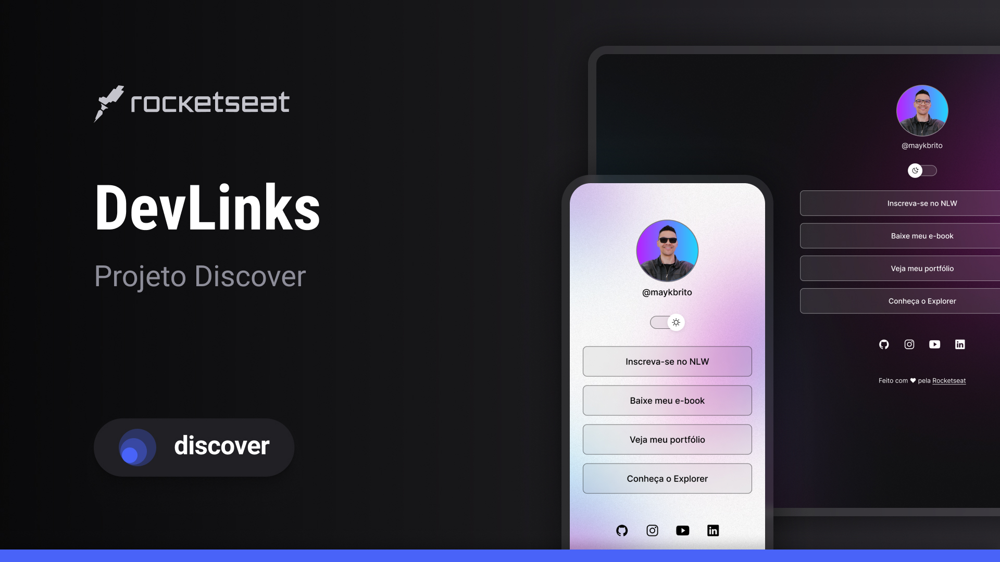

  

## 🖥️ projeto
Esse e um Projeto Feito Com o Discovery Da Rockeatseat Para Ser Usado Como Um Cartão De Visitas Na Web

## 🚀tecnologias 
-HTML

-CSS

-Git,GITHUB

-Javascript

## 🏷️layout
Voce Pode Visualizar o Layout Atráves 
[Desse link](https://www.figma.com/file/zvImKEBczMkkH7OzFG8yhO/DevLinks-%E2%80%A2-Projeto-Discover-(Community)?type=design&node-id=1437-191&t=J9pBaaPbpnEpYdfg-0)
e nessesario ter uma conta no [Figma](https://www.figma.com)